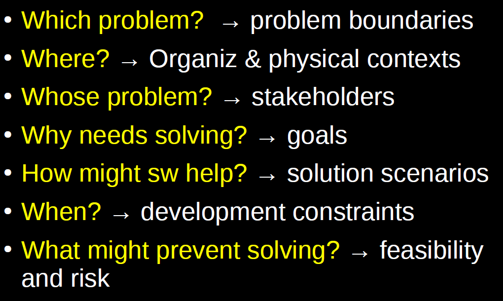
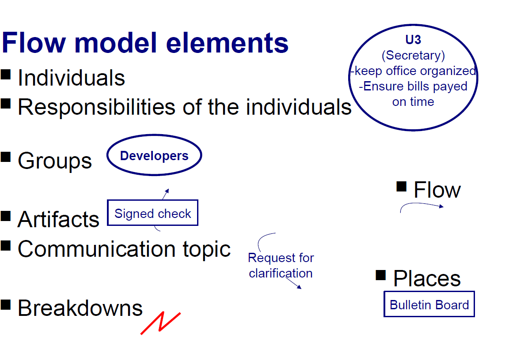
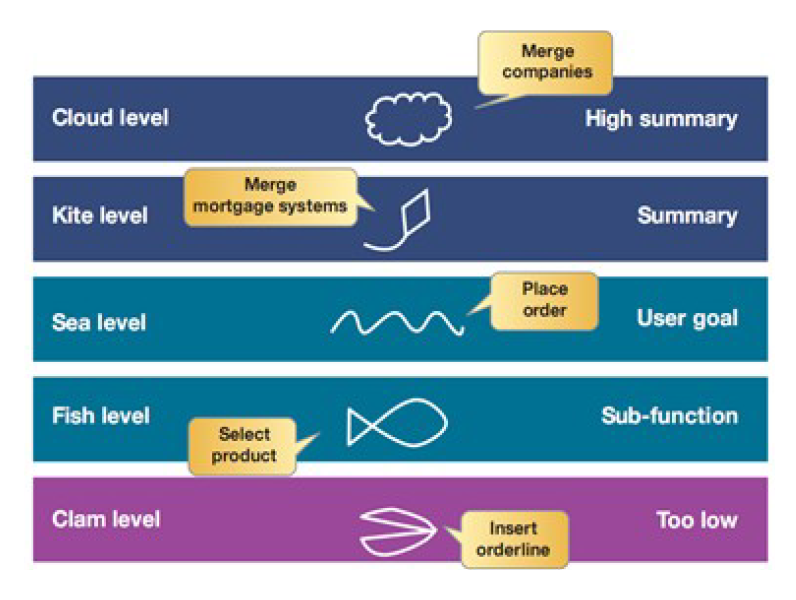

# Content

1. [Chapter 1: Introduction](#chapter1)
2. [Chapter 2: What is Requirements Engineering?](#chapter2)
    - [Chapter 2 - Part 1: What is Requirements Engineering?](#chapter2part1)
    - [Chapter 2 - Part 2: Software-Intensive Systems](#chapter2part2)
    - [Chapter 2 - Part 3: Fitness for Purpose](#chapter2part3)
    - [Chapter 2 - Part 4: Complexity of Purpose](#chapter2part4)
    - [Chapter 2 - Part 5: Types of Software Systems and Why Requirements Change?](#chapter2part5)
    - [Chapter 2 - Part 6: Dealing with Complexity](#chapter2part6)
    - [Chapter 2 - Part 7: Defining Requirements Engineering](#chapter2part7)
    - [Chapter 2 - Part 8: What do Requirements Analysts Do?](#chapter2part8)
3. [Chapter 3: What is Contextual Design?](#chapter3)
    - [Chapter 3 - Part 1: What is Contextual Design?](#chapter3part1)
    - [Chapter 3 - Part 2: Motivations and Key Principles](#chapter3part2)
    - [Chapter 3 - Part 3: Description of the Contextual Design Process](#chapter3part3)
    - [Chapter 3 - Part 4: Contextual Inquiry](#chapter3part4)
    - [Chapter 3 - Part 5: Contextual Interview](#chapter3part5)
    - [Chapter 3 - Part 6: Work Modeling](#chapter3part6)
    - [Chapter 3 - Part 7: The Interpretation Session](#chapter3part7)
    - [Chapter 3 - Part 8: Consolidation](#chapter3part8)
    - [Chapter 3 - Part 9: Affinity Diagrams](#chapter3part9)
    - [Chapter 3 - Part 10: Consolidating Flow Models](#chapter3part10)
    - [Chapter 3 - Part 11: Designing from Data](#chapter3part11)
    - [Chapter 3 - Part 12: The Design Response: Visioning](#chapter3part12)
    - [Chapter 3 - Part 13: Storyboards](#chapter3part13)
4. [Chapter 4: Writing Effective Use Cases](#chapter4)
    - [Chapter 4 - Part 1: What are Use Cases?](#chapter4part1)
    - [Chapter 4 - Part 2: Requirements and Use Cases](#chapter4part2)
    - [Chapter 4 - Part 3: Three Concepts to Apply to Every Use Case](#chapter4part3)
    - [Chapter 4 - Part 4: Parts of a Use Case](#chapter4part4)
    - [Chapter 4 - Part 5: Use Cases as a Contract Behavior](#chapter4part5)
    - [Chapter 4 - Part 6: Scope](#chapter4part6)
    - [Chapter 4 - Part 7: Stakeholders & Actors](#chapter4part7)
    - [Chapter 4 - Part 8: Three Named Goal Levels](#chapter4part8)
    - [Chapter 4 - Part 9: Preconditions, Triggers, Guarantees](#chapter4part9)
    - [Chapter 4 - Part 10: Scenarios and Steps](#chapter4part10)
    - [Chapter 4 - Part 11: Extensions](#chapter4part11)
    - [Chapter 4 - Part 12: Use Case Formats](#chapter4part12)
    - [Chapter 4 - Part 13: Use Case vs User Story](#chapter4part13)
5. [Bibliography's](#biblio)

## Chapter 1: Introduction

The goals of the requirements engineering course, is prepare software engineers to construct and analyze systems that are heavily constrained by contextual considerations in
addition to the usual technical requirements. Is the process of defining, documenting, and maintaining requirements in the engineering design process. We expect that you are able to describe faithfully the problem and what a possible solution might look like.

In the waterfall model, requirements engineering is presented as the first phase of the development process. Later development methods, including the Rational Unified Process (RUP) (agile software development methodology) for software, assume that requirements engineering continues through a system's lifetime.

Always there is a gap between, what the client needs and beginning of software development, and this we call **requirements elicitation**

**Topics**

- Methods for understanding and describe the problem the client wants to solve. (the description impacts our understanding!)
    - How to understand the problem to solve.
    - How to describe the problem.
    - Expected outcome (understand that good solutions come not from applying processes, but from genuinely understanding the client’s real needs, then selecting and applying whatever techniques are appropriate to solvin your client’s problem).
- Various factors that constrain the possible solutions.
- Approaches to deciding amongst alternatives.

**Core Concepts**

- What do we mean by “Requirements Engineering”.
- Different approaches to elicit technical needs.
- Matching the design to user needs.
- Understand and analyzing business, economic, and policy constraints.
- Know how to select the most appropriate approach.

1. Eliciting technical needs
    1. Contextual design
        - A method for discovering subtle user requirements.
        - Translating them into an initial design.
        - Iterating with prototypes and customer feedback in order to validate and refine the design.
   2. Use case modeling
        - Technique for identifying an appropriate System Boundary.
        - Understanding the interactions of external entities with the system.
        - Developing the capabilities the system should provide.
        - Understanding the domain where the software problem is situated.
   3. Goal-oriented modeling
        - An approach that allows for requirements to be extracted from goals, not by functionalities.
        - It will expose you to an alternative approach to a different class of problems.
        - Very effective to uncover non-functional requirements.

 2. Matching the design to user needs
    1. Application of e.g. Norman's principles (usability engineering).
        - Requires constructing at least two different prototypes for two focus areas of the user environment design (UED) that is the final product of the previous phases of the project.

 3. Understanding and analyzing business, economic, and policy constraints.
    1. We review elementary financial concepts and discuss the ways business and regulatory considerations (e.g. GDPR) that can be the dominating factors in software design decisions.

 4. An engineering approach
    1. After this course you should be able to select the most appropriate technique to the specific class of problem you face.
    2. Adopting an engineering approach to software systems.
    3. The need to reconcile conflicting constraints with limited time, knowledge, and resources.

The activities involved in requirements engineering vary widely, depending on the type of system being developed and the organization's specific practice(s) involved. These may include:

1. [**Requirements inception or requirements elicitation**][elicitation-url] – Developers and stakeholders meet; the latter are inquired concerning their needs and wants regarding the software product.
2. [**Requirements analysis and negotiation**][analysis-url] – Requirements are identified (including new ones if the development is iterative), and conflicts with stakeholders are solved. Both written and graphical tools (the latter commonly used in the design phase, but some find them helpful at this stage, too) are successfully used as aids. Examples of written analysis tools: use cases and user stories. Examples of graphical tools: UML and LML.
3. [**System modeling**][modeling-url] – Some engineering fields (or specific situations) require the product to be completely designed and modeled before its construction or fabrication starts. Therefore, the design phase must be performed in advance. For instance, blueprints for a building must be elaborated before any contract can be approved and signed. Many fields might derive models of the system with the [Lifecycle Modeling Language][LML-url], whereas others, might use UML. Note: In many fields, such as software engineering, most modeling activities are classified as design activities and not as requirement engineering activities.
4. **Requirements specification** – Requirements are documented in a formal artifact called a Requirements Specification (RS), which will become official only after validation. A RS can contain both written and graphical (models) information if necessary. Example: [Software requirements specification][software-requirement-url] (SRS).
5. **Requirements validation** – Checking that the documented requirements and models are consistent and meet the stakeholder's needs. Only if the final draft passes the validation process, the RS becomes official.
6. [**Requirements management**][management-url] – Managing all the activities related to the requirements since inception, supervising as the system is developed, and even until after it is put into use (e. g., changes, extensions, etc.)

## Chapter 2: What is Requirements Engineering?

#### Chapter 2 - Part 1: What is Requirements Engineering?

Requirements engineering (RE) refers to the process of defining, documenting, and maintaining requirements in the engineering design process. Requirement engineering provides the appropriate mechanism to understand what the customer desires, analyzing the need, and assessing feasibility, negotiating a reasonable solution, specifying the solution clearly, validating the specifications and managing the requirements as they are transformed into a working system. Thus, requirement engineering is the disciplined application of proven principles, methods, tools, and notation to describe a proposed system's intended behavior and its associated constraints.

 

 Fig 1 - Requirement Engineer Process - (<a href='https://www.javatpoint.com/software-engineering-requirement-engineering'>Work by JavaTPoint - https://www.javatpoint.com/ </a>) 

 

We will begin with the idea of a software-intensive system, by which we mean an interrelated set of human activities, supported by computer technology.The requirements
express the purpose of such a system. They allow us to say something meaningful about how good a particular system is, by exposing how well it suits its purpose. Or, more
usefully, they allow us to predict how well it will suit its purpose, if we design it in a particular way. The idea of human-centered design is crucial – the real goal of an
engineering process is to improve human activities in some way, rather than to build some technological artifact. Or, put another way, requirements engineering bridges the gap
between an initial vague recognition that there is some problem to which we can apply computer technology, and the task of building a system to address the problem.

 

 Fig 2 - Requirement Engineer Process - (<a href='https://www.uc.pt/en/fctuc/dei'>Work by University of Coimbra - DEI - https://www.uc.pt/en/fctuc/dei </a>) 

 

Computer systems are designed, and anything that is designed has an intended purpose. If a computer system is unsatisfactory, it is because the system was designed without an adequate understanding of its purpose, or because we are using it for a purpose different from the intended one. Both problems can be mitigated by careful analysis of purpose throughout a system’s life. Requirements Engineering provides a framework for understanding the purpose of a system and the contexts in which it will be used.

In seeking to describe the purpose of a computer system, we need to look beyond the system itself, and into the human activities that it will support. For example, the purpose of a banking system is not to be found in the technology used to build such systems, but in the business activities of banks and day-to-day needs of their customers. The purpose of an online flight reservation system is not to be found in the details of the web technology used to implement it, but in the desire by passengers for more convenient ways of booking their travel, and the desire of airlines to provide competitive and profitable services.

Such human activities may be complex, because they generally involve many different types of people, with conflicting interests.Requirements engineering techniques offer ways of dealing with complexity, by systematically breaking down complex problems into simpler ones, so that we can understand them better.

For some types of software, we may already have an excellent understanding of the intended purpose, even before we start the project. For other types of software, the problem to be tackled may be simple to describe, even if the solution is not. In both these cases, requirements engineering techniques may not be needed. However, some problems look simple until we start to analyze them, and some people develop software systems thinking that they understand the purpose, but find out (eventually!) that they were wrong. So we need to first consider what type of projects need requirements engineering. We will begin with the idea of a software-intensive system, consider the importance of fitness-for-purpose, and take a closer look at complexity of purpose. This will lead us to a definition of requirements engineering. 

#### Chapter 2 - Part 2: Software-Intensive Systems

To understand the scope of requirements engineering, we will consider the idea of a software-intensive system. Some software is designed to run on a ‘standard’ PC platform, meaning a particular combination of workstation, operating system, keyboard, mouse, printer and network connection. For other types of software, we may need to design specialist hardware or special configurations of hardware devices along with the software. Either way, the hardware platform and the software together form a system, and we can refer to these software+hardware combinations as “computer systems”. 

But we don’t mean just computer systems either – computer systems on their own are also useless. Computer systems can only do useful things when they are placed in some human context where they can support some human activity. This human context provides a purpose for the computer system. Sometimes this human context will be taken for granted – when computer systems are designed to be used in ‘standard’ contexts for ‘standard’ types of task. For example, web servers, email clients, word processors, and even aircraft autopilots are designed for relatively well-understood user groups, engaged in fairly routine activities. Nevertheless, any new computer system will lead to some changes in the human activities that it supports. Effectively, this means the human activity system must also be (re-)designed along with the computer system. For example, if you design a new air traffic control system, you must take care to design an appropriate set of roles and coordination mechanisms for the people whose work it will support. If you design a new web browser, you should consider the ways in which it will change how people access the web. This is because the computer and the human activities together form a system. This is what we call a software-intensive system.

The term ‘software-intensive system’ describes systems that incorporate hardware, software and human activities.

 

 Fig 3 - Software Intensive Systems - (<a href='https://www.uc.pt/en/fctuc/dei'>Work by University of Coimbra - DEI - https://www.uc.pt/en/fctuc/dei </a>) 

 

#### Chapter 2 - Part 3: Fitness for Purpose

We can say a system is badly designed if it is not well suited to the purpose for which it was intended. If the system is supposed to make some job more efficient, and it does not, then it is a poor system. If it is supposed to make a risky activity (like flying) safer, but does not, then it is a poor system. Turning this around, we define quality in terms of fitness-for-purpose. This means that we cannot assess quality as a measure of software by itself; we can only assess quality when we consider the software in the context of a set of human activities. In other words, software on its own cannot be said to be of ‘high quality’ or of ‘low quality’, because quality is an attribute of the relationship between software and the purposes for which it is used. This means that requirements engineering plays a critical role in our understanding and assessment of **software quality**.

The different purposes of a system may be associated with different stakeholders, or with the different roles that the stakeholders play.

A systematic investigation of the purpose for any proposed software-intensive system is therefore essential. If we do not fully understand the purpose of a computer system, we cannot assess its quality. Further, if we do not understand the intended purpose of a system that we are trying to design, then we can only ever achieve good quality by accident.

 

 Fig 4 - Fitness of Prupose - (<a href='https://www.uc.pt/en/fctuc/dei'>Work by University of Coimbra - DEI - https://www.uc.pt/en/fctuc/dei </a>) 

 

#### Chapter 2 - Part 4: Complexity of Purpose

Because software-intensive systems involve a high degree of interaction between people, software and hardware, they are intrinsically complex. To get a sense of this complexity, consider first the **physical** interaction between people and computers. Devices that contain little or no software tend to have relatively simple interfaces – a few buttons to push, handles to hold, warning lights to flash, etc. By contrast, a typical computer has close to a hundred buttons/keys to push, together with hundreds of menu items to select, commands to type, and icons to click.

Consider also the **duration** of interaction. There are very few devices that we use intensively for hours on end, and those few that we do tend to have simple, unchanging modes of interaction. We might drive a car for hours, but for most of that time we will use no more than a handful of actions (turn the wheel, press the brake, activate the turn signals, etc). If we use a computer for hours, we are likely to carry out hundreds of different actions during the interaction.

Now consider the question of **control** in this interaction. Human-computer interaction is **mixed-initiative** – sometimes we tell the computer to do things, but just as often it tells us to do things. When a person carries out some task with the help of a computer, the responsibility for various steps of the task frequently passes back and forth between the computer and the person.

Finally, consider the **situatedness** of this interaction. The activities that computers support are nearly always the activities of a group of people. Sometimes the computer system mediates the interaction and coordination of these people (for example, when we use email, shared files, wikis and chats, etc), while at other times it is on the periphery, assisting or recording the work of individual members of the group.

The actions of the software are woven so closely with human activities that each shapes the other in ways that are hard to predict. In other words, the activities of software and people are **closely coupled**. This close coupling is a major source of complexity for software-intensive systems. Because of its complex interactions with the world, the purpose of the software is complex.

Because of this complexity of purpose, the design of software-intensive systems belong to a class of problems known as **wicked problems**. The term was coined by Rittel and Webber for problems that have the following characteristics:
 - There is no definitive formulation of the problem – for example because different stakeholders each have their own conception of what the problem is.
 - There is no stopping rule – each solution is likely to lead to new insights into the problem, and the problem is never likely to be solved entirely.
 - Solutions are not right or wrong, but merely better or worse.
 - There is no objective test of how good a particular solution is – such a test involves the subjective judgment of various stakeholders.
 - There is no pre-existing set of potential solutions, nor is there a well-described set of features of such solutions. These must be discovered during problem analysis.
 - Every wicked problem is essentially unique – each problem is sufficiently complex that no other problem is exactly like it.
 - Every wicked problem can be considered to be a symptom of another problem, which means it is hard to isolate the problem and hard to choose an appropriate level of abstraction to describe the problem.
 - The designer has no ‘right’ to be wrong – because wicked problems often have strong political, ethical or professional dimensions, stakeholders tend to be intolerant of any perceived mistakes by the designer.
    
The over-riding feature of wicked problems is that arriving at an agreed statement of the problem is the problem. Wicked problems are not just ill-defined; rather they are the kinds of problems that tend to defy description.

#### Chapter 2 - Part 5: Types of Software Systems and Why Requirements Change?

- E-type
    - Embedded in human activities
- S-type
    - Can be completely and precisely Specified
- P-type
    - Designed to solve a Precisely specified problem

E-type software is subject to continuous evolution, or it will become steadily less useful over time.

 

 Fig 5 - E-Type - (<a href='https://www.uc.pt/en/fctuc/dei'>Work by University of Coimbra - DEI - https://www.uc.pt/en/fctuc/dei </a>) 

 

 Fig 6 - E-Type and S/P-Type - (<a href='https://www.uc.pt/en/fctuc/dei'>Work by University of Coimbra - DEI - https://www.uc.pt/en/fctuc/dei </a>) 

 

 Fig 7 - Why do requirements change? - (<a href='https://www.uc.pt/en/fctuc/dei'>Work by University of Coimbra - DEI - https://www.uc.pt/en/fctuc/dei </a>) 

 

#### Chapter 2 - Part 6: Dealing with Complexity

Requirements Engineering offers a number of techniques for dealing with complexity of purpose, which are built into the various techniques. Of these, three general principles are so useful that we will briefly introduce them here: abstraction, decomposition and projection:

- Abstraction involves ignoring the details so that we can see the big picture. When we take some set of human-computer activities and describe them as a system, we are using an abstraction. When we take two different actions and describe them as instances of the same general activity, we are using an abstraction.

- Decomposition involves breaking a set of phenomena into parts, so that we can study them independently. Such decompositions are never perfect, because of the coupling between the parts, but a good decomposition still offers us insights into how things work.

- Projection involves adopting a particular view or perspective, and describing only the aspects that are relevant to that perspective. Unlike decomposition, the perspectives are not intended to be independent in any way.

#### Chapter 2 - Part 7: Defining Requirements Engineering

**Requirements Engineering (RE) is a set of activities concerned with identifying and communicating the purpose of a software-intensive system, and the contexts in which it will be used. Hence, RE acts as the bridge between the real-world needs of users, customers, and other constituencies affected by a software system, and the capabilities and opportunities afforded by software-intensive technologies.**

The name **requirements engineering** may seem a little awkward. Both words carry some unfortunate connotations:

- **Requirements** suggests that there is someone out there doing the **requiring** – a specific customer who knows what she wants. In some projects, requirements are understood to be the list of features (or functions, properties, constraints, etc.) demanded by the customer. In practice, there is rarely a single customer, but rather a diverse set of people who will be affected in one way or another by the system. These people may have varied and conflicting goals. Their goals may not be explicit, or may be hard to articulate. They may not know what they want or what is possible. Under these circumstances, asking them what they **require** is not likely to be fruitful.

- **Engineering** suggests that RE is an engineering discipline in its own right, whereas it is really a fragment of a larger process of engineering software-intensive systems. The term **engineering** also suggests that the outputs of an RE process need to be carefully engineered, where those **outputs** are usually understood to be detailed specifications. It is true that in some projects, a great deal of care is warranted when writing specifications, especially if misunderstandings could lead to safety or security problems. However, in other projects it may be reasonable not to write detailed specifications at all. In many RE processes, it is the understanding that is gained from applying systematic analysis techniques that is important, rather than the documented specifications.

One of the key themes is that requirements engineering is an essential part of any attempt to develop any kind of software-intensive system. All such systems have a purpose – whether we call it ‘the requirements’ or ‘users needs’ or ‘product features’, or whatever.

#### Chapter 2 - Part 8: What do Requirements Analysts Do?

Because of the diversity of contexts in which Requirements Engineering is conducted, and the variety of systems to which it is applied, there is no ‘one way’ to do requirements engineering. The process for developing a specification for a control system will be very different from the process for exploring the requirements for a new information system. There are a number of activities essential to RE that need to be addressed in one way or another in any RE process.

We can characterize some of these activities through a series of questions that a requirements analyst must address. Imagine a journalist, given a new story to cover. She must investigate the story, and then write it up in a concise way, perhaps to fit a certain number of column inches in the newspaper. Journalists often start by formulating a range of questions to ask, to get the basics of the story, using the seven question types: Who?, What?, Where?, When?, Why?, Which?, and How? We can apply this technique to requirements engineering by exploring the following questions:

- **Which problem needs to be solved?** Usually, some idea of a problem or opportunity has already been identified before a requirements-gathering exercise begins. But some choice is involved: choosing from a set of possible problems, or choosing the part of a large complex problem that can be feasibly solved. Equally important is the decision about which problems (or aspects of the problem) will not be solved. The requirements analyst is responsible for setting an appropriate scope for the project by identifying Problem Boundaries.

- **Where is the problem?** The discussion so far in this chapter has underlined the importance of understanding the context for any proposed software-intensive system. This includes an investigation of both the physical and organizational context: locations and organizational units that are affected by the problem, or which will need to be involved in implementing a solution. The organizational context is especially important for understanding whether the right problem is being tackled. The physical context is especially important for systems that are to be used in harsh or demanding environments (e.g. remote terrain, or busy control rooms). The requirements analyst is responsible for ensuring that all participants of the development process understand the Problem Domain.

- **Whose problem is it?** The development of any new system may have an impact upon a huge range of different people. Often, they will have competing needs, and different perceptions of the problem. The requirements analyst is responsible for identifying and characterizing all the relevant Stakeholders.

- **Why does it need solving?** In order to make good design decisions, it is necessary to understand the motivations and rationale that the stakeholders have for wanting the problem solved. The requirements analyst is responsible for identifying and analyzing the stakeholders’ Goals.

- **How might a software system help?** As we shall see in chapter 2, it is impossible to completely separate requirements from design. Hence, it is entirely appropriate to understand whether the stakeholders have any preconceptions of what the solution might look like, so that their expectations can be taken into account. The requirements analyst is responsible for identifying a set of Scenarios that capture the stakeholders’ expectations for how the problem might be solved.

- **When does it need solving?** Providing a perfect solution to the problem a year after it was needed is unlikely to be acceptable. In the software industry, the delivery date is often set before anything else is agreed. Any constraints on schedule demanded by the application domain are valid requirements, as are other resource constraints such as cost, available staffing, and so on. The requirements analyst is responsible for identifying all the relevant Development Constraints.

- **What might prevent us from solving it?** Requirements engineering is crucial for risk management – requirements engineers must balance the selection and scoping of the problem with the feasibility of implementing a solution within the given constraints. The requirements analyst is responsible for analyzing Feasibility and Risk.

 

 Fig 8 - What do Requirements Analysts Do? - (<a href='https://www.uc.pt/en/fctuc/dei'>Work by University of Coimbra - DEI - https://www.uc.pt/en/fctuc/dei </a>) 

 

## Chapter 3: What is Contextual Design?

#### Chapter 3 - Part 1: What is Contextual Design?

Contextual Design is a structured, well-defined user-centered design process that provides methods to collect data about users in the field, interpret and consolidate that data in a structured way, use the data to create and prototype product and service concepts, and iteratively test and refine those concepts with users. This is the core of the Contextual Design philosophy - understand users in order to find out their fundamental intents, desires, and drivers. But these are invisible to the users - so the only way to glean them is to go out in the field and talk with people.

#### Chapter 3 - Part 2: Motivations and Key Principles?

**1 - Principle: System design must support and extend users' work practice**

In Contextual Design, the term work practice refers to the complex and detailed set of behaviors, attitudes, goals and intents that characterize a set of users in a particular environment. All manner of activities and design domains are characterized by work practice - not only workplaces. For example, there are obviously work practices associated with business pursuits like office work, but there are also "work practices" associated with life events such as making purchases as a consumer, driving an automobile, playing music and even watching television. A central tenet of Contextual Design is that any technology, product or system must be designed to support and extend its users' work practice . If it does so well, it will be accepted and valued; if it fails to do so, it will cause dissatisfaction, frustration, avoidance and workarounds.

Implications for the designer: To create a successful product, first be aware of users' work practice and design for it explicitly.

**2 - Principle: People are experts at what they do - but are unable to articulate their own work practice**

Complicating the designer's job are two facts about work practice. The first is that people are not consciously aware of their own work practice; all of their knowledge is tacit. This is especially true when people are taken out of the context of their everyday environment. It is only when users are immersed in normal contexts of use that they can become aware of their own work practice - what they do in detail and why.

The second is that work practice is complex and varied, and that useful design data are hidden in everyday details. Many systems fall short of expectations because they fail to take into considerations seemingly insignificant details of work practice - details that are not consciously available to users when they are not engaged in the ongoing work.

Contextual Design holds that design team members must go into the field and observe and talk with users in their natural work or life environments - their natural contexts - in order to understand work practice. This is the principle of context from which the process draws its name.

Implications for the designer: Use field interviews to reveal tacit aspects of users' work practice - the motivations, workarounds, and strategies that they may never articulate, but structure their work.

**3 - Principle: Good design requires partnership and participation with users**

Even while in context, users are not always able to intuit and articulate their own behaviors and detailed motivations.

The interviewer actively questions the user and partners with them to draw out and understand their work practice in detail. The interviewer thus does not enter with a preformed list of questions, as in a survey or focus group, but rather adopts a master-apprentice relationship model , seeking to understand the user's work as an apprentice would from a master, as the work is ongoing.

This key concept of partnership also comes into play in Contextual Design's use of paper prototypes and short iterations with users to work out detailed design.

Implications for the designer: Don't just observe when you're in the field. Ask questions and suggest interpretations of the user's actions and motivations. Articulate what matters about the work together.

**4 - Principle: Good design is systemic**

Any good design considers the system and its impact on users as a whole: the handles on a Mini Cooper reflect the aesthetic of the entire car; the iPhone's characteristic user interface elements (including gestures) are carried through the entire design and the apps;

Contextual Design provides methods that help a team keep the design coherent. The Contextual Design vision provides a high-level coherent direction; the storyboards provide coherence of task; the User Environment Design ensures structural coherence across the system. All these methods - which are explained in the following section - encourage the designer to think about the entire system, rather than treating each part as its own independent problem to be solved. This provides users with a seamless

Implications for the designer: Use concrete representations to maintain system coherence: function, structure, layout, and flow across the system.

**5 - Principle: Design depends on explicit representations**

When people design, they create physical representations of their concepts. Whether written on the back of a napkin or captured in a high-end modeling tool, designers need a tangible representation of their thoughts. From sketches to formal diagrams, drawings enable designers to work out their ideas, capture their thinking, share it with others, discuss it, and identify weaknesses.

Contextual Design supports this need for a physical representation throughout the design process. Work models make work practice - how users approach their work - explicit, public, and sharable. The User Environment Design shows the structure of the system as experienced by the user. Each technique in Contextual Design has its own tangible representation that supports doing the work, capturing the result, and sharing it with others. These physical representations in Contextual Design are described in the next section.

Implications for the designer: Use drawings, sketches and models to capture key design considerations at every step of the process.

#### Chapter 3 - Part 3: Description of the Contextual Design Process

Contextual Design is broadly divided into two major phases: **Requirements and Solutions** and **Define & Validate Concepts**

 

 Fig 9 - The Contextual Design Process - (<a href='https://www.interaction-design.org/literature/book/the-encyclopedia-of-human-computer-interaction-2nd-ed/contextual-design#copyrightNotice'>Work by By Karen Holtzblatt and Hugh R. Beyer - https://www.interaction-design.org/literature/book/the-encyclopedia-of-human-computer-interaction-2nd-ed </a>) 

 

#### Chapter 3 - Part 4: Contextual Inquiry

The first problem for design is to understand the customers: the people who will use the solution directly (end-users); those who provide them information or use their output (indirect users); those who manage them and are responsible for their success (managers); those who purchase the product and may have their own, quite independent, criteria. For most projects, the main focus is nearly always on the end-users, but it is important to consider and evaluate the needs of the other types of customers as well.

Contextual inquiry involves two steps: **contextual interview** and **interpretation session**

#### Chapter 3 - Part 5: Contextual Interview

One-on-one interviews with customers in their workplace as they work;...

A contextual interviewer observes users as they work and inquires into the users' actions as they unfold to understand their motivations and strategy. The interviewer and user, through discussion, develop a shared interpretation of the work. It is like an active inquiry into the user's world. This inquiry, done in context, is where Contextual Inquiry gets its name.

 - Contextual interview principles
   - **Context:** go to the customer's workplace and watch them perform their chores.
   - **Partnership:** talk to them and engage them in uncovering unarticulated aspects of work. Adopt a master-apprentice relation.
   - **Interpretation:** shared understanding of aspects that matter; facts are not enough.
   - **Focus:** direct the inquiry from a clear understanding of your own purpose.
   - **Who should you interview:** ‘Representative’ users; Job role; Work group. Try to qualify in advance interview candidates.

#### Chapter 3 - Part 6: Work Modeling

As described earlier, people's work is complex and full of detail. It's also intangible - there has traditionally been no good way to write down or talk about work practice. Design teams seldom have the critical skill of seeing the structure of work done by others, looking past the surface detail to see the intents, strategies, and motivations that control how work is done - and typical development methodologies do little to encourage this perspective.

 - Work models principles:
   - Formalize the observations
   - Focus the process
   - A common language between stakeholders
     - Being graphical eases communication
     - Also better reflect relations
   - Guide thought

Because this is immensely important, so in Contextual Design, work models are used to capture the work of individuals and organizations in diagrams. Five different models provide five perspectives on how work is done:

 - The basic five Work Models
   - **Flow**
     - Communication and coordination
   - **Sequence**
     - Detailed work steps
   - **Artifacts**
     - Physical things necessary to do the work
   - **Culture**
     - Constraints caused by policies or values
   - **Physical**
     - How the physical structures affect the work

**The flow model:** captures communication and coordination between people to accomplish work. It reveals the formal and informal workgroups and communication patterns critical to doing the work. It shows how work is divided into formal and informal roles and responsibilities.

 

 Fig 10 - The Flow Model - (<a href='https://www.interaction-design.org/literature/book/the-encyclopedia-of-human-computer-interaction-2nd-ed/contextual-design#copyrightNotice'>Work by By Karen Holtzblatt and Hugh R. Beyer - https://www.interaction-design.org/literature/book/the-encyclopedia-of-human-computer-interaction-2nd-ed </a>) 

 

 Fig 11 - The Flow Model - (<a href='https://www.uc.pt/en/fctuc/dei'>Work by University of Coimbra - DEI - https://www.uc.pt/en/fctuc/dei </a>) 

 

 Fig 12 - The Flow Model - (<a href='https://www.uc.pt/en/fctuc/dei'>Work by University of Coimbra - DEI - https://www.uc.pt/en/fctuc/dei </a>) 

 

**The cultural model:** captures culture and policy that constrain how work is done. It shows how people are constrained and how they work around those constraints to make sure the work is done

 

 Fig 13 - The Cultural Model- (<a href='https://www.interaction-design.org/literature/book/the-encyclopedia-of-human-computer-interaction-2nd-ed/contextual-design#copyrightNotice'>Work by By Karen Holtzblatt and Hugh R. Beyer - https://www.interaction-design.org/literature/book/the-encyclopedia-of-human-computer-interaction-2nd-ed </a>) 

 

 Fig 14 - The Cultural Model- (<a href='https://www.uc.pt/en/fctuc/dei'>Work by University of Coimbra - DEI - https://www.uc.pt/en/fctuc/dei </a>) 

 

**The sequence model:** shows the detailed steps performed to accomplish each task important to the work. It shows the different strategies people use, the intents or goals that their task steps are trying to accomplish, and the problems getting in their way.

 

 Fig 15 - The Sequencial Model - (<a href='https://www.interaction-design.org/literature/book/the-encyclopedia-of-human-computer-interaction-2nd-ed/contextual-design#copyrightNotice'>Work by By Karen Holtzblatt and Hugh R. Beyer - https://www.interaction-design.org/literature/book/the-encyclopedia-of-human-computer-interaction-2nd-ed </a>) 

 

 Fig 16 - The Sequencial Model - (<a href='https://www.uc.pt/en/fctuc/dei'>Work by University of Coimbra - DEI - https://www.uc.pt/en/fctuc/dei </a>) 

 

**The physical model:** shows the physical environment as it supports or gets in the way of the work. It shows how people organize their environments to make their work easier.

 

 Fig 17 - The Contextual Design Process - (<a href='https://www.interaction-design.org/literature/book/the-encyclopedia-of-human-computer-interaction-2nd-ed/contextual-design#copyrightNotice'>Work by By Karen Holtzblatt and Hugh R. Beyer - https://www.interaction-design.org/literature/book/the-encyclopedia-of-human-computer-interaction-2nd-ed </a>) 

 

 Fig 18 - The Contextual Design Process - (<a href='https://www.uc.pt/en/fctuc/dei'>Work by University of Coimbra - DEI - https://www.uc.pt/en/fctuc/dei </a>) 

 

**The artifact model:** shows the artifacts that are created and used in doing the work. Artifacts reveal how people think about their work - the concepts they use and how they organize them to get the work done.

 

 Fig 19 - The Contextual Design Process - (<a href='https://www.interaction-design.org/literature/book/the-encyclopedia-of-human-computer-interaction-2nd-ed/contextual-design#copyrightNotice'>Work by By Karen Holtzblatt and Hugh R. Beyer - https://www.interaction-design.org/literature/book/the-encyclopedia-of-human-computer-interaction-2nd-ed </a>) 

 

 Fig 20 - The Contextual Design Process - (<a href='https://www.uc.pt/en/fctuc/dei'>Work by University of Coimbra - DEI - https://www.uc.pt/en/fctuc/dei </a>) 

 

#### Chapter 3 - Part 7: The Interpretation Session

Followed by team interpretation sessions to build a shared view of the work model...

Team interpretation sessions bring a cross-functional design team together to hear the whole story of an interview and capture the insights and learning relevant to their design problem. An interpretation session lets everyone on the team bring their unique perspective to the data, sharing design, marketing, and business implications. Through these discussions, the team comes to understand the customer whose data is being interpreted and their needs, while at the same time capturing issues, drawing work models, and developing a shared understanding of the customer's world.

- To build a shared understanding of the feedback from the customers.
- Each one can learn from the other's perspective.
- Draft the projects' Work Models.
- Record activities in a structured way.

 

 Fig 21 - The Interpretation Session - (<a href='https://www.uc.pt/en/fctuc/dei'>Work by University of Coimbra - DEI - https://www.uc.pt/en/fctuc/dei </a>) 

 

**Roles**
  - Interviewer
  - Work modeler(s)
    - Work Flow and Culture
    - Sequences
  - Recorder
    - Ux/ID/description
  - Moderator
  - Participants
    - Rat hole watchers

**Running the session**
  - Interpretation within 48h of interview
  - Up to 2 or 3 hours
  - 'Capture that' (and don't dig into rat holes)
  - No evaluation yet; just capture.
  - List top insights, capture them on-line, and write them on the wall.
 
#### Chapter 3 - Part 8: Consolidation

Systems are seldom designed for a single customer. But designing for a whole customer population - the market, department, or organization that will use the system - depends on seeing the common aspects of the work different people do.

Consolidation brings data from individual customer interviews together so the team can see common pattern and structure without losing individual variation. The affinity diagram brings together issues and insights across all customers into a wall-sized, hierarchical diagram to reveal the scope of the problem.

#### Chapter 3 - Part 9: Affinity Diagrams

The affinity diagram brings together issues and insights across all customers into a wall-sized, hierarchical diagram to reveal the scope of the problem and the opportunities.

**How to Make Affinity Diagrams**

- Organizes individual notes during the interpretation session bottom to top, into a hierarchy revealing common issues and themes.

- Create stories about the customer, relevant to the design problem.

- Use a large wall.

- Always try to finish an affinity diagram in a single day

- Affinity diagrams are built bottom to top

- Use direct language rather than formal.
  - Disagreement should be welcome:discuss!

- Two notes have an affinity if they are saying similar things about the work as it relates to the design focus of the team.

- Ask the interviewer when in doubt.

 

 Fig 22 - Affinity Diagrams - (<a href='https://www.uc.pt/en/fctuc/dei'>Work by University of Coimbra - DEI - https://www.uc.pt/en/fctuc/dei </a>) 

 

 Fig 23 - Affinity Diagrams - (<a href='https://www.interaction-design.org/literature/book/the-encyclopedia-of-human-computer-interaction-2nd-ed/contextual-design#copyrightNotice'>Work by By Karen Holtzblatt and Hugh R. Beyer - https://www.interaction-design.org/literature/book/the-encyclopedia-of-human-computer-interaction-2nd-ed </a>) 

 

 Fig 24 - Affinity Diagrams - (<a href='https://www.uc.pt/en/fctuc/dei'>Work by University of Coimbra - DEI - https://www.uc.pt/en/fctuc/dei </a>) 

 

 Fig 25 - Affinity Diagrams - (<a href='https://www.uc.pt/en/fctuc/dei'>Work by University of Coimbra - DEI - https://www.uc.pt/en/fctuc/dei </a>) 

 

 Fig 26 - Affinity Diagrams - (<a href='https://www.uc.pt/en/fctuc/dei'>Work by University of Coimbra - DEI - https://www.uc.pt/en/fctuc/dei </a>) 

 

#### Chapter 3 - Part 10: Consolidating Flow Models

Consolidated work models bring together each different type of work model separately, to reveal common strategies and intents while retaining and organizing individual differences. Together, the affinity diagram and consolidated work models produce a single picture of the customer population a design will address. They give the team a focus for the design conversation, showing how the work hangs together rather than breaking it up in lists. They show what matters in the work and guide the structuring of a coherent response, including system focus and features, business actions, and delivery mechanisms.

**Consolidated Flow Model:** Flow model consolidation reveals the common structure that underlies all different ways organizations define work.

- Use ROLES as the essential element of work practice on which to base this consolidation.

- A role collects responsibilities which accomplish an intent.

- Users normally perform more than one role.

- Select 6 to 9 complex individuals

- List responsibilities and identify roles. Name them.

- Collect similar roles from all models in the consolidated model.

- Rewrite/review responsibilities and role name

- Collect artifacts, communication and breakdowns and apply them to the new roles.

- Compare remaining individual models against the consolidated flow. Add/change whatever necessary.

 

 Fig 27 - Consolidated Flow Model - (<a href='https://www.interaction-design.org/literature/book/the-encyclopedia-of-human-computer-interaction-2nd-ed/contextual-design#copyrightNotice'>Work by By Karen Holtzblatt and Hugh R. Beyer - https://www.interaction-design.org/literature/book/the-encyclopedia-of-human-computer-interaction-2nd-ed </a>) 

 

**Consolidated Cultural Model:**

- The consolidated cultural model reveals common values, friction and policy.

- **Beware:** culture is not unique within populations doing common work practice.

 

 Fig 28 - Consolidated Cultural Model - (<a href='https://www.interaction-design.org/literature/book/the-encyclopedia-of-human-computer-interaction-2nd-ed/contextual-design#copyrightNotice'>Work by By Karen Holtzblatt and Hugh R. Beyer - https://www.interaction-design.org/literature/book/the-encyclopedia-of-human-computer-interaction-2nd-ed </a>) 

 

**Portion of Consolidated Sequence Model:** Consolidated sequences show task structure and work strategies. Despite saying the opposite, most people use only a few strategies to do a task.

- The consolidated sequence includes all actions you saw any user take, not just the common actions most users take—it is a super-set, not a sub-set of user activity.

- We consolidate the user data, we don’t condense it.

**Activity > Intent(s) > Abstract step(s) > Actions**

**Activity:** navigating in the filesystem > 
**Intent:** Create a subdirectory >
**Abstract step(s):**
  - Find where she is in the filesystem (location)
  - Position at the upstream location
  - Create a local directory
  - (...)
**Actions:**
  - “cd .. →cd ..” until reaches home/user (…)
  - cd dir→cd→dir.. until she reaches the intended location
  - mkdir new-dir

 

 Fig 29 - Consolidated Sequence Model - (<a href='https://www.interaction-design.org/literature/book/the-encyclopedia-of-human-computer-interaction-2nd-ed/contextual-design#copyrightNotice'>Work by By Karen Holtzblatt and Hugh R. Beyer - https://www.interaction-design.org/literature/book/the-encyclopedia-of-human-computer-interaction-2nd-ed </a>) 

 

**Consolidated Physical Model:**

- Shows the common physical structure across the customer population and the key variants that a system will have to deal with.

 

 Fig 30 - Consolidated Physical Model - (<a href='https://www.interaction-design.org/literature/book/the-encyclopedia-of-human-computer-interaction-2nd-ed/contextual-design#copyrightNotice'>Work by By Karen Holtzblatt and Hugh R. Beyer - https://www.interaction-design.org/literature/book/the-encyclopedia-of-human-computer-interaction-2nd-ed </a>) 

 

**Consolidated Artifact Model:**

- Shows common organizing themes and concepts that people use to pattern their work.

- Let project focus determine which artifact types to consolidate.

- Identify common parts of the artifacts, as well as usage and intent.

- Let real data drive design
  - (not as 'should be').

 

 Fig 31 - Consolidated Artifact Model - (<a href='https://www.interaction-design.org/literature/book/the-encyclopedia-of-human-computer-interaction-2nd-ed/contextual-design#copyrightNotice'>Work by By Karen Holtzblatt and Hugh R. Beyer - https://www.interaction-design.org/literature/book/the-encyclopedia-of-human-computer-interaction-2nd-ed </a>) 

 

Together, the affinity diagram and consolidated work models produce a single picture of the customer population a design will address.

They give the team a focus for the design conversation, showing how the work functions as a whole rather than breaking it up in lists.

#### Chapter 3 - Part 11: Designing from Data

Personas can help bring users alive and focus the stakeholders on the relevant issues, if they are built from rich contextual data. Popularized by Alan Cooper, a persona describes typical users of the proposed system as though they were real people (Cooper 1998). Their use is becoming more widespread, though with mixed success. According to Harley Manning's research, "a persona that's not backed by rich contextual data isn't valid, which accounts for much of the mixed success." (Manning 2003)

Contextual Design calls for building personas from the field data the team collected and consolidated to help focus on the characters the design team will vision about in the next step, to help stakeholders segment their market according to practice instead of typical demographics, to clarify branding and prioritization, and to bring the users and their needs to life for developers. Contextual Design personas are built from the detailed data gathered through Contextual Inquiry interviews, so they have the richness and depth needed to drive design.

- Going from customer data to a design, requires a creative leap.

- Data never dictates exactly what to design.

- Contextual Design suggests a way to extract design from this data: to invent multiple possible responses to the data, different visions.

#### Chapter 3 - Part 12: The Design Response: Visioning

Up to this point, a Contextual Design project focuses on understanding the users as they are. Now a team must invent the design solution using technology to transform the tasks, and possibly also designing new business processes to streamline tasks or new services to support the market. A Contextual Design team invents these solutions through visioning.

In visioning, the team uses the consolidated data to drive conversations about how to improve users' work by using technology to transform the work practice. This focuses the conversation on how to improve people's lives with technology, rather than on what could be done with technology without considering the impact on peoples' real lives.

The vision captures a story of how customers will do their work in the new world the team invents. A vision includes the system, its delivery, and support structures to make the new work practice successful. It is intentionally rough and high-level - a vision sets a possible design direction, without fleshing out every detail. This enables the team to see the overall structure of the solution and ensure its coherence.

**Process steps into the vision**

- Walking the data
  - To see different aspects of the problem
- Visioning
  - To invent multiple responses to the data
- Evaluation and integration
  - To develop a single response
- Concurrent actions
  - To move all parts of the organization in parallel.

**Creating a vision**

- Find the perfect ‘mantra’: “An airBnB for pet-sitting”, “An OLX for local services”, “A financial adviser in my smartphone”, “A Facebook for athletes only”, “A technical documentation writer robot”
- A vision is a drawing showing what the new work practice would be like if the vision were in place (the 'pen').
  - Balance creativity against practicality.
  - Beware horses designed by committees...
  - List positives and negatives for each vision.
- Evaluate issues in parallel
  - The vision acts as a map that keeps the team coordinated while working independently.

 

 Fig 32 - The Vision - (<a href='https://www.interaction-design.org/literature/book/the-encyclopedia-of-human-computer-interaction-2nd-ed/contextual-design#copyrightNotice'>Work by By Karen Holtzblatt and Hugh R. Beyer - https://www.interaction-design.org/literature/book/the-encyclopedia-of-human-computer-interaction-2nd-ed </a>) 

 

#### Chapter 3 - Part 13: Storyboards

The vision defines the high-level design response to users' needs. To become actionable, the team must define the detailed function, behavior, and structure of the proposed system. This next level of design must take the users' tasks into account and ensure the right function is defined in the right system places for a smooth workflow. As you'll see in the following section, Contextual Design provides for this structural design through storyboards and the User Environment Design, and then validates the design through paper prototypes.

Each storyboard describes how users will accomplish a task in the new system. They show the steps the user will take and the system function that supports each step. The task may be handed off between users, and may be supported by several systems operating together; the storyboard ensures the task remains coherent across these boundaries.

A storyboard is represented as a sequence of "freeze-frame" sketches or cells, each one capturing one step in the overall task

- Storyboards show how specific tasks will be accomplished.

- Therefore checking for tasks' coherence in the new system.

 

 Fig 33 - The StoryBoard - (<a href='https://www.interaction-design.org/literature/book/the-encyclopedia-of-human-computer-interaction-2nd-ed/contextual-design#copyrightNotice'>Work by By Karen Holtzblatt and Hugh R. Beyer - https://www.interaction-design.org/literature/book/the-encyclopedia-of-human-computer-interaction-2nd-ed </a>) 

 

## Chapter 4: Writing Effective Use Cases

#### Chapter 4 - Part 1: What are Use Cases?

- Use cases are fundamentally a text form (*).

- They describe system behavior, by

- Capturing a contract between stakeholders
  - i.e. an intention.

A use case captures a contract between the stakeholders of a system about its behavior. The use case describes the system’s behavior under various conditions as it responds to a request from one of the stakeholders, called the primary actor. The primary actor initiates an interaction with the system to accomplish some goal. The system responds, protecting the interests of all the stakeholders. Different sequences of behavior, or scenarios, can unfold, depending on the particular requests made and conditions surrounding the requests. The use case collects together those different scenarios.

Use cases are fundamentally a text form, although they can be written using flow charts, sequence charts, Petri nets, or programming languages. Under normal circumstances, they serve to communicate from one person to another, often to people with no special training. Simple text is, therefore, usually the best choice.

The use case, as a form of writing, can be put into service to stimulate discussion within a team about an upcoming system. They might later use that the use case form to document the actual requirements. Another team might later document the final design with the same use case form. They might do this for a system as large as an entire company, or as small as a piece of a software application program. What is interesting is that the same basic rules of writing apply to all these different situations, even though the people will write with different amounts of rigor, at different levels of technical detail.

When the use cases document an organization’s business processes, the system under discussion is the organization itself. The stakeholders are the company shareholders, customers, vendors, and government regulatory agencies. The primary actors will include the company’s customers and perhaps their suppliers.

When the use cases record behavioral requirements for a piece of software, the system under discussion is the computer program. The stakeholders are the people who use the program, the company owning it, government regulatory agencies, and other computer programs. The primary actor will be the user sitting at the computer screen or another computer system. 

Use cases are a form of writing that can be put to use in different situations, to describe:

- a business' work process, 

- to focus discussion about upcoming software system requirements, but not be the requirements description,

- to be the functional requirements for a system, or

- to document the design of the system.

- They might be written in a small, close-knit group, or in a formal setting, or in a large or distributed group.

 

 Fig 34 - Example of Use Case Diagrams - (<a href='https://www.uc.pt/en/fctuc/dei'>Work by University of Coimbra - DEI - https://www.uc.pt/en/fctuc/dei </a>) 

 

#### Chapter 4 - Part 2: Requirements and Use Cases

- Use Cases are requirements
  - functional

- They are not all the requirements
  - Development processes
  - Business rules
  - Quality attributes (non-functional)
  - Human, legal, regulatory issues
  - Unresolved or deferred...

- If you are writing use cases as requirements, you should keep two things in mind.

  - They really are requirements. You shouldn’t have to convert them into some other form of behavioral requirements. Properly written, they accurately detail what the system must do. 

  - They are not all of the requirements. They don’t detail external interfaces, data formats, business rules and complex formulae. They constitute only a fraction (perhaps a third) of all the requirements you need to collect - a very important fraction, but still only a fraction. 

Every organization collects requirements to suit its needs. There are even standards available for requirements descriptions. In any of them, use cases occupy only one part of the total requirements documented.

#### Chapter 4 - Part 3: Three Concepts to Apply to Every Use Case

**Primary Actor**

  - Who has the goal?

**Level**

  - How low- or high-level is the goal?

  - Summary level (white, cloud, kite)
    - Operate an insurance policy
    
  - User Goals: Sea level (blue, sea, )
    - Register a new customer
    
  - Sub-functions (underwater, fish/clam, indigo/black)
    - Save as a pdf file

 

 Fig 35 - Levels of Abstraction - (<a href='https://www.uc.pt/en/fctuc/dei'>Work by University of Coimbra - DEI - https://www.uc.pt/en/fctuc/dei </a>) 

 

 Fig 36 - Levels of Abstraction - (<a href='https://www.uc.pt/en/fctuc/dei'>Work by University of Coimbra - DEI - https://www.uc.pt/en/fctuc/dei </a>) 

 

**Scope**

  - What is really the (sub)system under discussion?

  - Defines the boundary of what we design

 

 Fig 37 - Scope - (<a href='https://www.uc.pt/en/fctuc/dei'>Work by University of Coimbra - DEI - https://www.uc.pt/en/fctuc/dei </a>) 

 

#### Chapter 4 - Part 4: Parts of a Use Case

- Primary Actor

- (Scope)

- (Stakeholders and Interests)

- Preconditions

- (Minimal guarantee)

- (Success guarantee)

- Main Success scenario

- Extensions

#### Chapter 4 - Part 5: Use Cases as a Contract Behavior

- Actors have goals (always use a verb)
  - e.g. “Check Assignment Grade”

- Interactions are compound
  - Main success scenario

- Goals can fail
  - Extensions/Alternative paths

The system under design is a mechanism to carry out a contract between various stakeholders. The use cases give the behavioral part of that contract. Every sentence in a use case is there because it describes an action that protects or furthers some interest of some stakeholder. A sentence might describe an interaction between two actors, or what the system must do internally to protect the stakeholders’ interests.

**Actors have goals**

Imagine a clerk sitting by the phone, with the job responsibility to take service requests over the phone (the clerk is the primary actor in Figure 38.). When a call comes in, the clerk has a goal: to have the computer register and initiate the request.

 

 Fig 38 - Scope - (<a href='https://www.ifi.uzh.ch/dam/jcr:00000000-25a0-3d08-0000-00000ce96422/weuc_extract.pdf'>Work  By Alistair Cockburn </a>) 

 

The system also has a job responsibility, to register and initiate the service request in our example. (It actually has the responsibility to protect the interests of all the stakeholders; with the clerk (primary actor) being just one of those stakeholders. For now, however, let us just focus on the system’s responsibility as providing a service to the primary actor.)

To carry out its job responsibility, the system formulates subgoals. It can carry out some subgoals internally. It needs the help of another, supporting, actor to carry out others. This supporting actor may be a printing subsystem or it may be another organization, such as a partner company or government agency.

The supporting actor usually carries out its promise and delivers the subgoal to the SuD. The SuD interacts some more with external actors. It achieves its subgoals in some sequence, until it finally delivers its responsibility, its service promise.

Delivering a service promise is a topmost goal, achieved through subgoals. The subgoals can be broken down into sub-subgoals, ad nauseam. There is potentially no end to listing sub-sub-(...sub)- goals, if we want to break down the actions of the actors finely enough.

Probably the most difficult part of writing good use cases is controlling the sub-sub-goals in the writing. Read more on this in Section 5.“Three Named Goal Levels” on page 69, Reminder 6.“Get the goal level right” on page 202, and Guideline 6:“It contain a ’reasonable’ set of actions.” on page 98.

This Actors & Goals conceptual model is handy, since it applies equally to businesses as to computer systems. The actors can be individual people, organizations, or computers. We can describe mixed systems, consisting of people, companies and computers. We can describe a software system driven by another computer system, calling upon a human supporting actor, or an organization calling upon a computer system or an individual. It is a useful and general model.

**Goals can fail**

What is the clerk with the customer on the phone supposed to do if the computer goes down in the middle of taking down the request? If the system cannot deliver its service promise, the clerk must invent a backup goal - in this case, probably using pencil and paper. The clerk still has a main job responsibility, and must have a plan in case the system fails to perform its part.

Similarly, the system might encounter a failure in one of its subgoals. Perhaps the primary actor sent in bad data, or perhaps there is an internal failure, or perhaps the supporting actor failed to deliver its promised service. How is it supposed to behave? That is a really interesting section of the SuD’s behavioral requirements.

In some cases, the system can repair the failure and resume the normal sequence of behavior. In some cases it must simply give up on the goal. If you go to your ATM and try to withdraw more money than you have access to, your goal to withdraw cash will simply fail. It will also fail if the ATM has lost its connection with the network computer. If you merely mistype your personal code, the system will give you a second chance to type it in correctly.

This focus on goal failures and failure responses are two reasons use cases make good behavioral descriptions of systems, and excellent functional requirements in general. People who have done functional decomposition and data-flow decompositions mention this as the most significant improvement they see that use cases offer them.

**Interactions are compound**

The simplest interaction is simply sending a message. "Hi, Jean," I say, as we pass in the hall. That is a simple interaction. In procedural programming, the corresponding simple interaction is a function call, such as print(value). In object-oriented programming it is one object sending a message to another: objectA->print(value).

A sequence of messages is also an interaction, a compound interaction. Suppose I go to the soda machine and put in a dollar bill for an 80-cent drink, and get told I need exact change. My interaction with the machine is:

1. I insert a dollar bill
2. I press "Coke"
3. Machine says "Exact change required"
4. I curse, push Coin Return
5. Machine returns a dollar’s worth of coins
6. . I take the coins (and walk away, mumbling)

We can compact a sequence, as though it were a single step ("I tried to buy a Coke from the machine, but it needed exact change."), and put that compacted step into a larger sequence:

1. I went to the company bank and got some money
2. I tried to buy a Coke from the machine, but it needed exact change
3. So I walked down to the cafeteria and bought one there.

So interactions can be rolled up or broken down as needed, just as goals can be. Each step in a scenario captures a goal, and so each step can be unfolded into its own use case!

So far, we have seen that a use case contains the set of possible scenarios for achieving a goal.
To be more complete, we need so add that:

- All the interactions relate to the same goal of the same primary actor

- The use case starts at the triggering event, and continues until the goal is delivered or abandoned, and the system’s completes its responsibilities with respect to the interaction

#### Chapter 4 - Part 6: Scope

Scope is the word we use for the extent of what we consider to be designed by us, as opposed to already existing or someone else's design job.

Keeping track of the scope of the project, or even just the scope of a discussion can be difficult. Rob Thomsett introduced me to a wonderful little tool for tracking and managing scope discussions, the In/Out List. It is absurdly simple and remarkably effective. It can be used to control scope discussions for ordinary meetings as well as project requirements.

Simply construct a table with three columns, the left column containing any topic at all, the next two columns saying "in" or "out". Whenever it appears there might confusion as to whether a topic is within the scope of the discussion, you add it to the table and ask people whether it is in or out. The amazing result, as Rob described and I have seen, is that while is it completely clear to each person in the room whether the topic is in or out, they often have opposite views! Rob relates that sometimes it requires an appeal up to the project’s steering committee to settle whether a particular topic really is inside the scope of work or not. In or out can make a difference of many workmonths. Try this little technique out on your next projects, or perhaps your next meeting!

 

 Fig 39 - In Out List - (<a href='https://www.ifi.uzh.ch/dam/jcr:00000000-25a0-3d08-0000-00000ce96422/weuc_extract.pdf'>Work  By Alistair Cockburn </a>) 

 

Use the in/out list right at the beginning of the requirements or use case writing activity, to separate those things that are going to be within the scope of work, from those that are out of scope. Refer back to the chart whenever the discussion seems to be going off-track, or some requirement is creeping into the discussion that might not belong. Update the chart as you go.

Use in/out list for topics relating to both the functional scope of the system under discussion, and the design scope of the system under discussion.

#### Chapter 4 - Part 7: Stakeholders & Actors

- Find ALL of them

- All actors are stakeholders, but the inverse might not be true.
  - Ex: owner might never use the system

- Primary actors initiate actions.

- An actor links use cases together by performing a number of roles (*).

(*) e.g. a ‘Manager’ can perform the role of a ‘Cashier’.

A stakeholder is someone who gets to participate in the contract. An actor is anything having behavior. As one student said, "It must be able to execute an ’IF’ statement." An actor might be a person, a company or organization, a computer program or a computer system, hardware or software or both.

Look for actors in:

- the stakeholders of the system

- the primary actor of a use case;

- the system under design, itself (SuD);

- the supporting actors of a use case;

- internal actors, components within the SuD;

**Stakeholders**

A stakeholder is someone with a vested interest in the behavior of the use case, even if they never interact directly with the system. Every primary actor is, of course, a stakeholder. But there are stakeholders who never interact directly with the system., even though they have a right to care how the system behaves. Examples are the owner of the system, the company’s board of directors, and regulatory bodies such as the Internal Revenue Service and the Department of Insurance.

**The primary actor of a use case**

The primary actor of a use case is the stakeholder that calls upon the system to deliver one of its services. The primary actor has a goal with respect to the system, one that can be satisfied by its operation. The primary actor is often, but not always, the actor who triggers the use case.

**Supporting actors**

A supporting actor of a use case is an external actor that provides a service to the system under design. It might be a high-speed printer, it might be a web service, or it might be a group of humans who have to do some research and get back to us (for example, the coroner's office, which provides the insurance company with confirmation of a person's death). We used to call this a secondary actor, but people found the term confusing. More people are now using the more natural term, supporting actor.

**The system under discussion, itself**

The system under discussion itself is an actor, a special one. We usually refer to it by its name, e.g, Acura. Otherwise we say the system, system under discussion, system under design, or SuD. It gets named or described in the Design Scope field of the use case, and is referred to either by its name or just as the system inside the use case.

**Internal actors and white-box use cases**

Most of the time, we treat the system under discussion as a black box, which we can not peek inside. Internal actors are carefully not mentioned. This makes good sense when we use the use cases to name requirements for a system that has not yet been designed.

#### Chapter 4 - Part 8: Three Named Goal Levels

 

 Fig 40 - The levels of use cases.  - (<a href='https://www.ifi.uzh.ch/dam/jcr:00000000-25a0-3d08-0000-00000ce96422/weuc_extract.pdf'>Work  By Alistair Cockburn </a>) 

 

**User-goals (blue, sea-level)**

The user goal is the goal of greatest interest. It is the goal the primary actor has in trying to get work done, or the user has in using the system at all. It corresponds to "elementary business process" in the business process engineering literature.

** Summary level (white, cloud / kite )**

Summary1-level goals involve multiple user goals. They serve three purposes in the describing the system:

- They show the context in which the user goals operate, 

- They show life-cycle sequencing of related goals, 

- They provide a table of contents for the lower-level use cases, both lower white use cases and blue use cases.|

Summary use cases typically execute over hours, days, weeks, months, or years. 

**Subfunctions (indigo/black, underwater /clam )**

Subfunction-level goals are those required to carry out user goals. Include them only as you have to. They are needed on occasion for readability, or because many other goals use them. Examples of subfunction use cases are "Find a product", "Find a Customer", "Save as a file."

Subfunction use cases are underwater, indigo. Some are really underwater, so far underwater that they sit in the mud on the bottom

#### Chapter 4 - Part 9: Preconditions, Triggers, Guarantees

**Preconditions**

- Announce what the system will ensure is true before the use case starts
  - User is logged on
  - User is at ‘select printer’ screen

The Precondition of the use case announces what the system will ensure is true before letting the use case start. Since it is enforced by the system and known to be true, it will not be checked again during the use case. A common example is, "the user has already logged on and been validated".

Generally, having a precondition indicates that some other use case has already run, to set up the condition. Let’s say that use case 92, Place an Order, relies on a precondition ("logged on"). I would immediately look to see which use case set it up (perhaps use case 91 is called Log On). I usually create a higher-level use case that mentions both use cases 91 and 92, so the reader can see the way the two fit together. In this example, it might be summary use case 90, Use the application

**Triggers**

- Specifies the event that gets the use case started
  - Customer inserts card
  - Customer calls in a complaint
  (consider as a step 0)

The Trigger states what event gets the use case started. Sometimes the trigger precedes the first step of the use case. Sometimes it is the first step of the use case. To date, I have not seen a convincing argument that one form can be applied in all cases. Nor have I noticed any confusion from choosing one way or the other. You will have to develop your personal or project style.

Consider a person using a banking machine, the ATM. The ATM system wakes up only when the person inserts their card. It is not meaningful to say that the trigger is when someone decides to use the ATM. The trigger, "Customer inserts card,", is also the first step in the use case.

**Minimal Guarantees**

- Are the fewest promises the system makes to the stakeholder, particularly when the primary goal cannot be achieved.
  - The system will log how far it got.
  - Order will be initiated only if payment received.
  - Payment cancelled, but request logged.

The Minimal Guarantees are the least promises the system makes to the stakeholders, particularly for when the primary actor’s goal cannot be delivered. They hold for when the goal is delivered, of course, but they are of real interest when the main goal is abandoned. Most of the time, two or more stakeholders have to be addressed in the minimal guarantees, examples being the user, the company providing the system, and possibly a government regulatory body.

**Success Guarantee**

- Postconditions

- The outcome from a successful interaction.
  - The customer will receive the money and the account balance will be correctly updated.

The Success Guarantee states what interests of the stakeholders are satisfied after a successful conclusion of the use case, either at the end of the main success scenario or the end of a successful alternative path. The Success Guarantee is generally written to add onto the Minimal Guarantee: all of the Minimal Guarantee is delivered, and some extra conditions are true. Those additional conditions include at least the goal stated in the use case title.

#### Chapter 4 - Part 10: Scenarios and Steps

- Start with the main success scenario.
  - No “IFs”
  - Use step numbers
  - Show the action intent, not the movement
  - Use plain direct language

**Common surrounding structure**

- The main success scenario and scenario extensions sit within the same structure. That consists of:

  - A condition under which the scenario runs. For the main success scenario, this is the use case precondition plus the use case trigger. For an extension scenario, this is the extension condition (perhaps with the step number or place in the scenario where that condition applies).

- A a goal to achieve. For the main success scenario, this is exactly the use case name, satisfying, of course, the stakeholders’ interests. For an extension scenario, the goal is either to complete the use case goal or to rejoin the main success scenario after handling the condition.

- A set of action steps. These form the body of the scenario, and follow the same rules in every scenario or scenario fragment.

- An end condition. The goal is achieved at the end of the main success scenario. A scenario fragment may end with the goal either being achieved or abandoned.

- A possible set of extensions, written as scenario fragments. Extensions to the main success scenario are placed in the Extensions section of the use case template. Extensions to extensions are placed directly inline, inside or just after the extension body.

**Action Steps**

- The action steps that make up a well-written use case are written in one grammatical form, a simple action in which one actor accomplishes a task or passes information to another actor.

"User enters name and address."
"At any time, user can request the money back."
"The system verifies that the name and account are current."
"The system updates the customer’s balance to reflect the charge."

Most of the time, the timing can be omitted, since steps generally follow one after the other.

There are many minor variations in ways to write the action steps, as you have already seen in the use

#### Chapter 4 - Part 11: Extensions and Alternatives

- From the main success scenario.

- 'hook' into the main (failed) success step.
  - 4 → 4a1, 4a2, 4a3...

<include> and <extend>

- An include dependency is actually the invocation of a use case by another one.
  - User resets password of her account

- An extending use case is an alternate course of the base use case.
  - Use very sparingly as cognitive complexity adds up very easily.

 

 Fig 41 - Alternatives - (<a href='https://www.uc.pt/en/fctuc/dei'>Work by University of Coimbra - DEI - https://www.uc.pt/en/fctuc/dei </a>) 

 

Extensions work this way: Below the main success scenario, for every place where the behavior can branch due to a particular condition, write down the condition, and then write the steps that handles it. Many extensions end by simply merging back in with the main success scenario.

The extension really is a stripped down use case. It starts with a condition, the condition that causes it to be relevant. It contains a sequence of action steps describing what happens under those conditions. It ends with delivery or abandonment of whatever goal the extension is about. There might be extensions to the extensions to handle the ifs and buts that are encountered along the way.

These extensions are where the most interesting system requirements reside. The main success scenario often is known to the people on the team. Failure handling often uses business rules that the developers do not know. The requirements writers frequently have to do some research to determine the correct system response. Quite often, that investigation introduces a new actor, new use case, or new extension condition.

#### Chapter 4 - Part 12: Use Case Formats

- Fully dressed
  - One column of text (not a table)
  - Numbered steps
  - No IF statements
  - A numbering convention in the extensions section that involves combinations of digits and letters (e.g. 2a, 2a1, 2a2,...)

 

 Fig 42 - Fully dressed - (<a href='https://www.uc.pt/en/fctuc/dei'>Work by University of Coimbra - DEI - https://www.uc.pt/en/fctuc/dei </a>) 

 

- Casual
  - Basically free text

 

 Fig 43 - Casual - (<a href='https://www.uc.pt/en/fctuc/dei'>Work by University of Coimbra - DEI - https://www.uc.pt/en/fctuc/dei </a>) 

 

- One-column table

 

 Fig 44 - One Columns Table - (<a href='https://www.uc.pt/en/fctuc/dei'>Work by University of Coimbra - DEI - https://www.uc.pt/en/fctuc/dei </a>) 

 

- Two-column Table
  - Left for primary actor, right for all others

 

 Fig 45 - Two Columns Table - (<a href='https://www.uc.pt/en/fctuc/dei'>Work by University of Coimbra - DEI - https://www.uc.pt/en/fctuc/dei </a>) 

 

- RUP style

 

 Fig 46 - RUP Style - (<a href='https://www.uc.pt/en/fctuc/dei'>Work by University of Coimbra - DEI - https://www.uc.pt/en/fctuc/dei </a>) 

 

#### Chapter 4 - Part 13: Use Case vs User Story

**Use case is not User Story**

**User story**

As a frequent flyer I want to get an integrated booking proposal (flight+hotel+car) in order to get the benefits of my special status.

USE CASES → formal, detailed

user stories → informal,conversational

# Bibliography's 

Some of references that I use.

1. [Systems Engineering Body of Knowledge][sebok-url]
2. [Software Development][sw-url]
3. [Contextual Design][contextual-url]
4. [Use Cases 1][usecasesbooks-url]
5. [Use Cases 2][usecasesbooks2-url]

<!-- URL's -->

[sebok-url]: https://www.sebokwiki.org/wiki/Guide_to_the_Systems_Engineering_Body_of_Knowledge_(SEBoK)
[sw-url]: https://en.wikipedia.org/wiki/Software_development
[contextual-url]: https://www.interaction-design.org/literature/book/the-encyclopedia-of-human-computer-interaction-2nd-ed/contextual-design#copyrightNotice
[usecasesbooks-url]: https://www.ifi.uzh.ch/dam/jcr:00000000-25a0-3d08-0000-00000ce96422/weuc_extract.pdf
[usecasesbooks2-url]: http://www-public.imtbs-tsp.eu/~gibson/Teaching/Teaching-ReadingMaterial/Cockburn00.pdf
